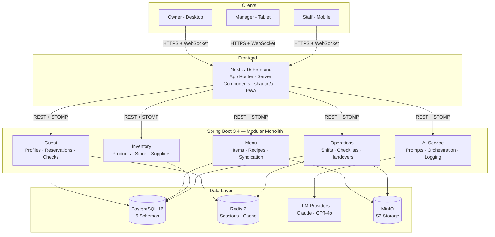

<p align="center">
  <strong>A modular monolith platform that digitizes gastronomy operations — from shift handovers and HACCP compliance to AI-powered menu descriptions and predictive inventory management.</strong>
</p>

<p align="center">
  
  
  
  
</p>

<p align="center">
  
  
  
  
  
  
  
  
  
</p>

---

## 🎯 What Is KesselOps?

**KesselOps** (Kessel = Stuttgart's valley basin, Ops = Operations) is a full-stack platform designed to replace the operational chaos in hospitality businesses — scattered WhatsApp messages, paper checklists, manual inventory counts, and disconnected shift handovers.

It covers the **entire back-of-house to front-of-house lifecycle**:

```
Staff Scheduling → Shift Execution → HACCP Compliance → Inventory Tracking
    → Menu Management → Guest Reservations → AI-Powered Insights
```

---

## 🧠 Architecture

### Modular Monolith — Microservice Boundaries, Monolith Speed

```
de.kesselops/
├── operations/     → Shifts, Checklists, Handovers, Staff Training
├── inventory/      → Products, Stock, Suppliers, Predictive Ordering
├── menu/           → MenuItems, Recipes, Syndication to Third Parties
├── guest/          → Profiles, Reservations, Evaluations, Sales (POS-lite)
├── ai/             → Prompt Templates, LLM Orchestration, Usage Tracking
└── shared/         → Auth, Config, DTOs, Exception Handling
```

**Why not microservices?** Clean domain boundaries are enforced at the package level. Each domain has its own controllers, services, and repositories. Zero inter-service overhead during development — but any domain can be extracted to a standalone service with no refactoring because boundaries are already clean.

### System Overview



---

## ✨ Key Features

### Operations & Compliance
- **Shift Planning** — Drag-drop assignment with PENDING → CONFIRMED → NO_SHOW tracking
- **Digital Checklists** — Opening/Closing/HACCP templates with timestamped photo proof
- **Shift Handovers** — Structured summaries replacing WhatsApp chaos (open issues, next steps, acknowledgement)
- **Staff Onboarding** — AI-generated role-specific training paths

### Inventory & Supply Chain
- **Real-time Stock Tracking** — Every consumption/waste/restock event logged with shift context
- **Recipe→Inventory Depletion** — Selling a cocktail automatically depletes its ingredient stock
- **Predictive Ordering** — Weather-aware reorder suggestions with supplier integration
- **Waste Analytics** — Per-shift, per-product waste patterns with sustainability metrics

### Menu & Guest Experience
- **Digital Menu Builder** — Categories, pricing, allergens, availability
- **Menu Syndication** — Auto-sync menus to speisekarte.de, Google Business, TripAdvisor
- **Guest Scoring** — Reverse evaluation system (restaurant rates guests on behavior/punctuality)
- **Reservation Management** — 6-state flow (PENDING → CONFIRMED → SEATED → COMPLETED / NO_SHOW / CANCELLED)
- **POS-lite** — Guest checks with item tracking, payment methods, per-shift revenue

### AI Layer (7 Features Across 5 Domains)

| Feature | Domain | What It Does |
|---------|--------|--------------|
| Staff Onboarding Generator | Operations | AI-generated role-specific training paths |
| Menu Description Generator | Menu | Appealing descriptions with allergen info |
| Shift Summary Generator | Operations | End-of-shift digest for handovers |
| Waste Pattern Analysis | Inventory | "Lime waste peaks on Mondays — reduce prep by 30%" |
| Social Media Post Generator | Marketing | Posts from shift data + photos |
| Google Review Responder | Guest | AI-drafted review responses |
| Predictive Staffing | Operations | Weather + event data → staff suggestions |

**AI Architecture:**
- Configurable `PromptTemplate` per venue per use case (stored in DB, not hardcoded)
- Per-venue AI personality (`toneOfVoice`: casual bar ≠ fine dining)
- Full audit trail: `AIUsageLog` tracks prompt, model, tokens, latency, acceptance rate
- Multi-provider: Claude (primary for reasoning) + GPT-4o (primary for content generation)

---

## 🛠️ Tech Stack

| Layer | Technology | Why |
|-------|-----------|-----|
| **Backend** | Java 21, Spring Boot 3.4, Spring Data JPA | Records, virtual threads, battle-tested ORM |
| **AI** | Spring AI + Anthropic Claude + OpenAI GPT-4o | Official Spring integration, model abstraction, retries |
| **Database** | PostgreSQL 16 (5 schemas, Flyway migrations) | JSONB for flexible fields, full-text search |
| **Cache** | Redis 7 | Sessions, menu cache, real-time state |
| **Frontend** | Next.js 15, TypeScript, Tailwind CSS, shadcn/ui | Server components, PWA, mobile-first |
| **State** | Zustand + TanStack Query v5 | Lightweight client state + server cache |
| **Real-time** | Spring WebSocket + STOMP | Live consumption dashboard push |
| **Storage** | MinIO (S3-compatible) | Photo proof, media uploads |
| **Auth** | Spring Security + JWT | Stateless, role-based (OWNER/MANAGER/STAFF/TRAINEE) |
| **DevOps** | Docker, GitHub Actions, Railway, Vercel | Zero-config deploy, free tier |

---

## 🗄️ Database Design

One PostgreSQL database, 5 schemas mirroring domains:

```sql
CREATE SCHEMA IF NOT EXISTS operations;   -- Shifts, Users, Checklists, Training
CREATE SCHEMA IF NOT EXISTS inventory;    -- Products, Stock, Suppliers, Orders
CREATE SCHEMA IF NOT EXISTS menu;         -- MenuItems, Recipes, Syndication
CREATE SCHEMA IF NOT EXISTS guest;        -- Profiles, Reservations, Checks
CREATE SCHEMA IF NOT EXISTS ai;           -- PromptTemplates, UsageLogs
```

**Key design decisions:**
- Recipe → RecipeIngredient → Product chain enables automatic stock depletion on sale
- GuestCheck ≠ Order (Order = money OUT to supplier, GuestCheck = money IN from guest)
- All entities are venue-scoped for multi-tenant support
- Performance indexes on high-frequency query patterns (shift lookups, stock logs, guest checks)

---

## 🚀 Quick Start

```bash
# Prerequisites: Java 21, Node.js 20+, Docker

# 1. Clone
git clone https://github.com/Syed1012/kesselops.git
cd kesselops

# 2. Start infrastructure
docker compose up -d  # PostgreSQL + Redis + MinIO

# 3. Run backend
cd backend
./mvnw spring-boot:run -Dspring-boot.run.profiles=dev

# 4. Run frontend
cd ../frontend
npm install && npm run dev

# 5. Open
open http://localhost:3000
```

API docs available at `http://localhost:8080/swagger-ui.html`

---

## 📐 Architecture Decisions (ADRs)

| # | Decision | Rationale |
|---|----------|-----------|
| 1 | Modular monolith over microservices | Single JVM, zero inter-service overhead, ship in 3 days |
| 2 | PostgreSQL over MongoDB | Relational data (shifts→users, orders→products), JSONB for flexibility |
| 3 | Next.js App Router over Pages | Server components, streaming SSR, better layouts |
| 4 | Spring AI over raw HTTP to LLMs | Retries, streaming, model abstraction |
| 5 | JWT over session cookies | Stateless backend, multi-client support |
| 6 | Flyway over Liquibase | SQL-based migrations, simpler and faster |
| 7 | Zustand over Redux | 2KB vs 42KB, sufficient for dashboard state |
| 8 | 5 DB schemas in 1 database | Cross-domain joins possible in monolith phase |
| 9 | Prompt templates in DB | Venues customize AI personality without code changes |

---

<p align="center">
  <em>Built in Stuttgart 🇩🇪 — 3 days, 5 domains, 27 entities, 7 AI features.</em>
</p>


