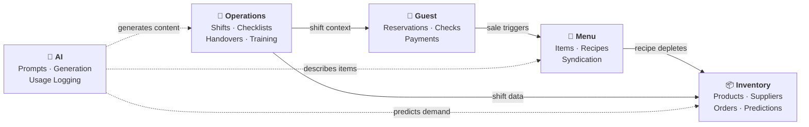
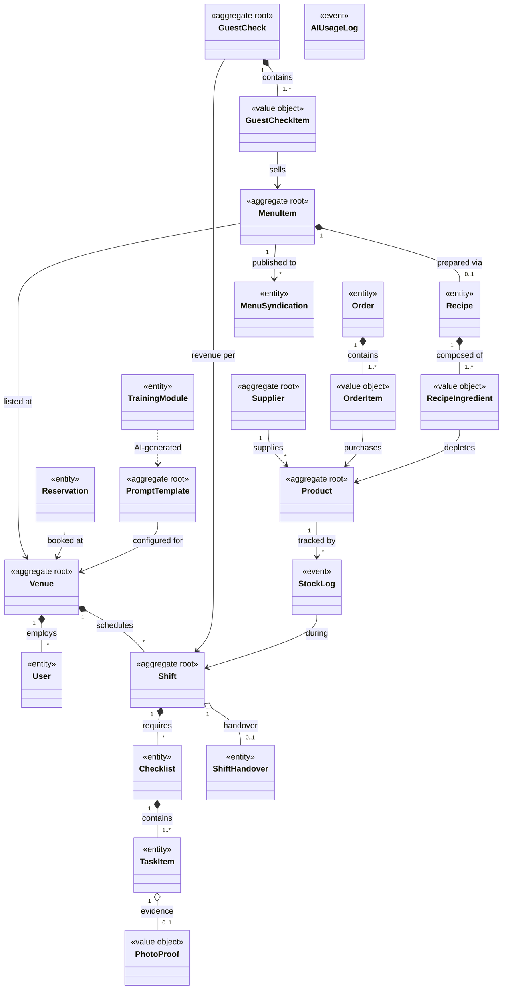
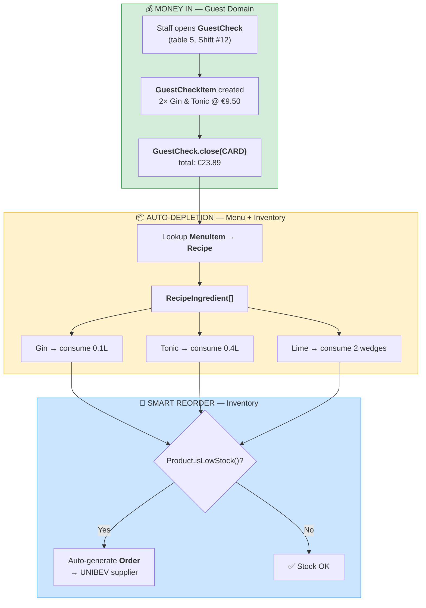
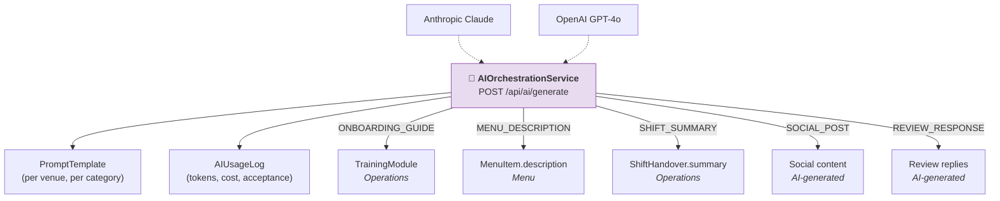
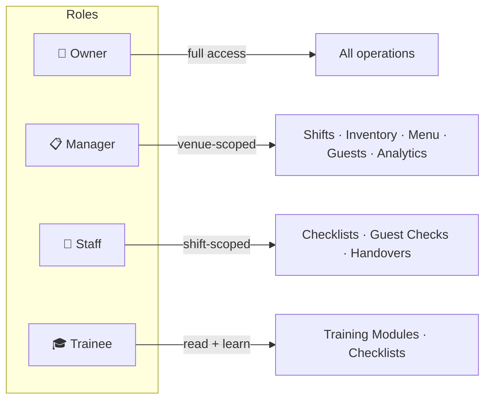

# KesselOps — Architecture & Domain Model

> **Hackathon Stuttgart 2026** · "Code. Cocktails. Repeat."
> _The brain behind every shift._
>
> Source of truth: [`system-design.md`](./system-design.md)

---

## 1. Bounded Context Map

Five clean domains. One modular monolith. One JAR to deploy.

---

## 2. Simplified Domain Model

> Inspired by DDD — shows **aggregate roots**, **entities**, and key cross-domain links.
> Readable in 30 seconds. Stereotypes mark each entity's role in the domain.

---

## 3. Core Data Flow — Sale → Depletion → Reorder

> This is the **killer feature**: selling a cocktail automatically depletes inventory
> and triggers smart reordering. No manual stock counting.

---

## 4. Domain Boundaries — Package Mapping

| Domain | Package | Entities | Key Responsibility |
|--------|---------|----------|--------------------|
| **A. Operations** | `com.kesselops.operations` | Venue, User, Shift, Checklist, TaskItem, PhotoProof, ShiftHandover, TrainingModule | Staff, shifts, checklists, HACCP, handovers, onboarding |
| **B. Inventory** | `com.kesselops.inventory` | Product, Supplier, StockLog, Order, OrderItem | Stock tracking, suppliers, orders, predictions |
| **C. Menu** | `com.kesselops.menu` | MenuItem, Recipe, RecipeIngredient, MenuSyndication | Digital menu, recipes, third-party syndication |
| **D. Guest** | `com.kesselops.guest` | Reservation, GuestCheck, GuestCheckItem | Reservations, sales transactions, payments |
| **E. AI** | `com.kesselops.ai` | PromptTemplate, AIUsageLog | Configurable AI brain, prompt management, usage audit |

---

## 5. Relationship Legend

| Notation | Meaning | Example |
|----------|---------|---------|
| `*--` | **Composition** (lifecycle-bound) | Shift *contains* Checklists — delete shift → delete checklists |
| `o--` | **Aggregation** (independent lifecycle) | TaskItem *may have* PhotoProof — photo can exist alone |
| `-->` | **Association** (references) | GuestCheckItem *sells* MenuItem |
| `..>` | **Dependency** (uses/calls) | TrainingModule *AI-generated via* PromptTemplate |

---

## 6. AI Integration Points

> AI is not a bolt-on chatbot — it's woven across 4 domains.

---

## 7. Role-Based Access Summary

---

_5 domains · 22 entities · 1 modular monolith · 3 days to ship._
