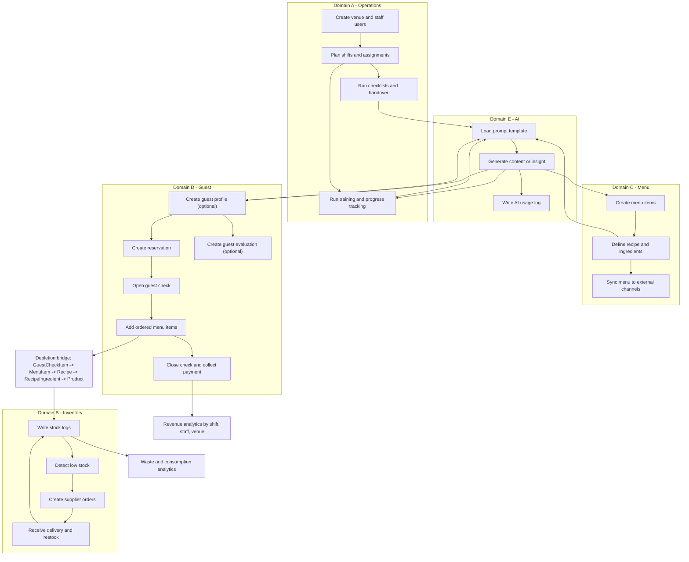

# KesselOps - Domain Flow (Simple)

This is a simplified end-to-end flow of the domain model across the 5 active domains.

## Quick Read

- Operations runs people, shifts, checklists, and onboarding.
- Menu defines what is sold.
- Guest handles reservations, checks, and evaluations.
- Inventory tracks stock and orders suppliers.
- AI supports onboarding, menu content, shift summaries, and guest insight.
- The key business chain is:
  `GuestCheckItem -> MenuItem -> Recipe -> RecipeIngredient -> Product -> StockLog -> Order`.
