# KesselOps - Domain Model & Class Diagram (Aligned)

> Source of truth: `docs/system-design.md`  
> Cross-checked with contracts under `contracts/openapi/`

## Scope

- Architecture: modular monolith
- Active domains: 5 (`operations`, `inventory`, `menu`, `guest`, `ai`)
- Core persisted entities: 27 (as defined in `docs/system-design.md`)
- Legacy domain artifacts (old Social/Marketing split and other removed classes) are intentionally excluded

## Mermaid.js Class Diagram

```mermaid
classDiagram

    %% ============================================
    %% DOMAIN A - OPERATIONS
    %% ============================================
    namespace Operations {
        class User {
            +Long id
            +String firstName
            +String lastName
            +String email
            +Role role
            +String phone
            +Boolean isActive
            +Long venueId
            +DateTime createdAt
            +DateTime updatedAt
        }

        class Role {
            <<enumeration>>
            OWNER
            MANAGER
            STAFF
            TRAINEE
        }

        class Venue {
            +Long id
            +String name
            +String address
            +String city
            +String type
            +String timezone
            +DateTime createdAt
        }

        class Shift {
            +Long id
            +Long venueId
            +DateTime startTime
            +DateTime endTime
            +ShiftType type
            +String notes
            +Boolean isActive
            +DateTime createdAt
        }

        class ShiftType {
            <<enumeration>>
            MORNING
            AFTERNOON
            EVENING
            NIGHT
        }

        class ShiftAssignment {
            +Long id
            +Long userId
            +Long shiftId
            +Role role
            +AssignmentStatus status
            +DateTime assignedAt
            +String assignedBy
        }

        class AssignmentStatus {
            <<enumeration>>
            PENDING
            CONFIRMED
            DECLINED
            NO_SHOW
        }

        class ShiftHandover {
            +Long id
            +Long fromShiftId
            +Long toShiftId
            +Long authorUserId
            +String summary
            +String openIssues
            +String nextSteps
            +DateTime acknowledgedAt
            +DateTime createdAt
        }

        class Checklist {
            +Long id
            +Long shiftId
            +ChecklistCategory category
            +String title
            +Boolean isCompleted
            +Double completionPercentage
            +DateTime createdAt
        }

        class ChecklistCategory {
            <<enumeration>>
            OPENING
            CLOSING
            HANDOVER
            HACCP
            EMERGENCY
        }

        class TaskItem {
            +Long id
            +Long checklistId
            +String description
            +TaskStatus status
            +Integer sortOrder
            +Boolean requiresPhoto
            +DateTime completedAt
            +Long completedByUserId
        }

        class TaskStatus {
            <<enumeration>>
            NOT_DONE
            DONE
            SKIPPED
        }

        class PhotoProof {
            +Long id
            +String fileUrl
            +String mimeType
            +Long fileSizeBytes
            +DateTime uploadedAt
            +Long uploadedByUserId
        }

        class TrainingModule {
            +Long id
            +String title
            +String description
            +Role targetRole
            +TrainingType type
            +String contentJson
            +Integer estimatedMinutes
            +Integer sortOrder
            +Boolean isAIGenerated
            +DateTime createdAt
        }

        class TrainingType {
            <<enumeration>>
            ONBOARDING
            HYGIENE
            SAFETY
            BEVERAGE
            SERVICE
            CHECKLIST_GUIDE
        }

        class StaffProgress {
            +Long id
            +Long userId
            +Long trainingModuleId
            +ProgressStatus status
            +Integer completionPercent
            +DateTime startedAt
            +DateTime completedAt
            +Integer quizScore
        }

        class ProgressStatus {
            <<enumeration>>
            NOT_STARTED
            IN_PROGRESS
            COMPLETED
        }
    }

    %% ============================================
    %% DOMAIN B - INVENTORY
    %% ============================================
    namespace Inventory {
        class Product {
            +Long id
            +String name
            +String sku
            +ProductCategory category
            +String unit
            +Double currentQuantity
            +Double reorderLevel
            +Double reorderQuantity
            +Double unitPrice
            +Long venueId
            +Boolean isActive
            +DateTime createdAt
        }

        class ProductCategory {
            <<enumeration>>
            SPIRITS
            WINE
            BEER
            COCKTAIL_KEG
            SOFT_DRINKS
            BOTANICAL_BOOSTER
            FOOD_INGREDIENT
            CONSUMABLE
        }

        class Supplier {
            +Long id
            +String name
            +String contactPerson
            +String email
            +String phone
            +String address
            +SupplierType type
            +Boolean isPreferred
            +DateTime createdAt
        }

        class SupplierType {
            <<enumeration>>
            BEVERAGE_DISTRIBUTOR
            FOOD_WHOLESALER
            COCKTAIL_KEG_PROVIDER
            CONSUMABLE_SUPPLIER
        }

        class SupplierProduct {
            +Long id
            +Long supplierId
            +Long productId
            +Double supplierPrice
            +String supplierSku
            +Integer leadTimeDays
            +Double minimumOrderQty
        }

        class StockLog {
            +Long id
            +Long productId
            +StockLogType type
            +Double quantityChange
            +Double previousQuantity
            +Double newQuantity
            +String reason
            +Long shiftId
            +Long userId
            +DateTime timestamp
        }

        class StockLogType {
            <<enumeration>>
            CONSUMPTION
            RESTOCK
            ADJUSTMENT
            WASTE
            MENU_DEPLETION
        }

        class Order {
            +Long id
            +Long supplierId
            +Long venueId
            +OrderStatus status
            +Double totalAmount
            +Boolean isAutoGenerated
            +DateTime expectedDelivery
            +DateTime actualDelivery
            +String notes
            +DateTime createdAt
        }

        class OrderStatus {
            <<enumeration>>
            DRAFT
            SUBMITTED
            CONFIRMED
            DELIVERED
            CANCELLED
        }

        class OrderItem {
            +Long id
            +Long orderId
            +Long productId
            +Double quantity
            +Double unitPrice
            +Double subtotal
        }
    }

    %% ============================================
    %% DOMAIN C - MENU
    %% ============================================
    namespace Menu {
        class MenuItem {
            +Long id
            +Long venueId
            +String name
            +String description
            +Double price
            +MenuCategory category
            +String imageUrl
            +Boolean isAvailable
            +Boolean isAlcoholFree
            +List~String~ allergens
            +Integer sortOrder
            +DateTime createdAt
        }

        class MenuCategory {
            <<enumeration>>
            COCKTAIL
            BEER
            WINE
            BOTANICAL_BOOSTER
            SOFT_DRINK
            COFFEE
            FOOD
            SPECIAL
        }

        class Recipe {
            +Long id
            +Long menuItemId
            +String preparationNotes
            +Integer prepTimeMinutes
            +DifficultyLevel difficultyLevel
        }

        class DifficultyLevel {
            <<enumeration>>
            EASY
            MEDIUM
            HARD
        }

        class RecipeIngredient {
            +Long id
            +Long recipeId
            +Long productId
            +Double quantity
            +String unit
            +Boolean isOptional
            +Double ingredientCost
        }

        class MenuSyndication {
            +Long id
            +Long menuItemId
            +SyndicationTarget target
            +SyncStatus syncStatus
            +DateTime lastSyncedAt
        }

        class SyndicationTarget {
            <<enumeration>>
            SPEISEKARTE_DE
            GOOGLE_BUSINESS
            TRIPADVISOR
            WEBSITE
        }

        class SyncStatus {
            <<enumeration>>
            PENDING
            SYNCED
            FAILED
            OUT_OF_DATE
        }
    }

    %% ============================================
    %% DOMAIN D - GUEST
    %% ============================================
    namespace Guest {
        class GuestProfile {
            +Long id
            +String firstName
            +String lastName
            +String email
            +String phone
            +Long venueId
            +Integer totalVisits
            +Integer noShowCount
            +Double totalSpend
            +Double averageSpend
            +Double guestScore
            +Boolean isVIP
            +Boolean isReliable
            +List~String~ preferences
            +String notes
            +DateTime createdAt
            +DateTime lastVisitAt
        }

        class Reservation {
            +Long id
            +Long guestProfileId
            +Long venueId
            +DateTime reservationTime
            +Integer partySize
            +String specialRequests
            +String tablePreference
            +ReservationStatus status
            +DateTime createdAt
        }

        class ReservationStatus {
            <<enumeration>>
            PENDING
            CONFIRMED
            SEATED
            COMPLETED
            CANCELLED
            NO_SHOW
        }

        class GuestEvaluation {
            +Long id
            +Long guestProfileId
            +Long reservationId
            +Long evaluatedByUserId
            +Integer behaviorRating
            +Integer punctualityRating
            +Integer overallRating
            +String comment
            +DateTime createdAt
        }

        class GuestCheck {
            +Long id
            +Long venueId
            +Long shiftId
            +Long servedByUserId
            +Long guestProfileId
            +Long reservationId
            +String tableNumber
            +Integer guestCount
            +GuestCheckStatus status
            +PaymentMethod paymentMethod
            +Double subtotal
            +Double taxAmount
            +Double tipAmount
            +Double discountAmount
            +Double totalAmount
            +DateTime openedAt
            +DateTime closedAt
        }

        class GuestCheckStatus {
            <<enumeration>>
            OPEN
            CLOSED
            VOID
            REFUNDED
        }

        class PaymentMethod {
            <<enumeration>>
            CASH
            CARD
            MOBILE_PAY
            SPLIT
            ON_HOUSE
        }

        class GuestCheckItem {
            +Long id
            +Long guestCheckId
            +Long menuItemId
            +Integer quantity
            +Double unitPrice
            +Double lineTotal
            +String modifiers
            +String notes
            +DateTime orderedAt
            +DateTime servedAt
        }
    }

    %% ============================================
    %% DOMAIN E - AI
    %% ============================================
    namespace AI {
        class PromptTemplate {
            +Long id
            +Long venueId
            +String name
            +String systemPrompt
            +String userPromptTemplate
            +PromptCategory category
            +String toneOfVoice
            +String language
            +Boolean isActive
            +Integer version
            +DateTime createdAt
        }

        class PromptCategory {
            <<enumeration>>
            SOCIAL_POST
            REVIEW_RESPONSE
            ONBOARDING_GUIDE
            MENU_DESCRIPTION
            SHIFT_SUMMARY
        }

        class AIUsageLog {
            +Long id
            +Long promptTemplateId
            +Long userId
            +String modelUsed
            +Integer inputTokens
            +Integer outputTokens
            +Double latencyMs
            +Boolean wasAccepted
            +DateTime timestamp
        }
    }

    %% ============================================
    %% RELATIONSHIPS - WITHIN DOMAINS
    %% ============================================

    User --> Role : has
    User "0..*" --> "1" Venue : belongs to
    Venue "1" --> "0..*" Shift : schedules
    Shift --> ShiftType : typed as

    User "1" --> "0..*" ShiftAssignment : assigned via
    Shift "1" --> "0..*" ShiftAssignment : staffed by
    ShiftAssignment --> AssignmentStatus : status

    Shift "1" *-- "0..*" Checklist : contains
    Checklist --> ChecklistCategory : category
    Checklist "1" *-- "1..*" TaskItem : has
    TaskItem --> TaskStatus : status
    TaskItem "1" o-- "0..1" PhotoProof : evidence

    Shift "1" o-- "0..1" ShiftHandover : handover
    ShiftHandover "0..1" --> "1" Shift : nextShift

    TrainingModule --> TrainingType : typed as
    TrainingModule --> Role : target role
    User "1" --> "0..*" StaffProgress : progresses
    TrainingModule "1" --> "0..*" StaffProgress : tracked by
    StaffProgress --> ProgressStatus : status

    Product --> ProductCategory : category
    Supplier --> SupplierType : type
    Supplier "1" --> "0..*" SupplierProduct : offers
    Product "1" --> "0..*" SupplierProduct : offered as

    Product "1" --> "0..*" StockLog : movements
    StockLog --> StockLogType : type

    Supplier "1" --> "0..*" Order : receives
    Order --> OrderStatus : status
    Order "1" *-- "1..*" OrderItem : contains
    OrderItem --> Product : references

    MenuItem --> MenuCategory : category
    MenuItem "1" *-- "0..1" Recipe : recipe
    Recipe --> DifficultyLevel : difficulty
    Recipe "1" *-- "1..*" RecipeIngredient : composed of
    MenuItem "1" --> "0..*" MenuSyndication : syndicated to
    MenuSyndication --> SyndicationTarget : target
    MenuSyndication --> SyncStatus : sync status

    GuestProfile "1" --> "0..*" Reservation : books
    GuestProfile "1" --> "0..*" GuestEvaluation : evaluated by venue
    GuestProfile "1" --> "0..*" GuestCheck : purchases via
    Reservation --> ReservationStatus : status
    GuestEvaluation "0..*" --> "0..1" Reservation : for reservation
    GuestEvaluation "0..*" --> "1" User : evaluated by
    GuestCheck --> GuestCheckStatus : status
    GuestCheck --> PaymentMethod : payment
    GuestCheck "1" *-- "1..*" GuestCheckItem : contains

    PromptTemplate --> PromptCategory : category
    AIUsageLog --> PromptTemplate : logs template
    AIUsageLog --> User : triggered by

    %% ============================================
    %% RELATIONSHIPS - CROSS DOMAIN
    %% ============================================

    StockLog "0..*" --> "0..1" Shift : during shift
    StockLog "0..*" --> "1" User : performed by

    MenuItem "0..*" --> "1" Venue : belongs to
    Product "0..*" --> "1" Venue : belongs to
    Order "0..*" --> "1" Venue : placed for
    GuestProfile "0..*" --> "1" Venue : registered at
    Reservation "0..*" --> "1" Venue : booked at
    GuestCheck "0..*" --> "1" Venue : opened at

    GuestCheck "0..*" --> "1" Shift : during
    GuestCheck "0..*" --> "1" User : served by
    Reservation "0..*" --> "0..1" GuestProfile : optional guest
    GuestCheck "0..1" --> "0..1" Reservation : fulfills
    GuestCheck "0..*" --> "0..1" GuestProfile : for guest
    GuestCheckItem "0..*" --> "1" MenuItem : sold item
    RecipeIngredient "0..*" --> "1" Product : depletes

    PromptTemplate "0..*" --> "0..1" Venue : venue-scoped
    TrainingModule ..> PromptTemplate : AI-generated onboarding
```

## Notes

- `GuestCheck` is the money-in transaction; `Order` is money-out procurement.
- The depletion chain is `GuestCheckItem -> MenuItem -> Recipe -> RecipeIngredient -> Product`.
- Contract projection/read models such as `VenueDashboard`, `ShiftRevenue`, `StockPrediction`, `ConsumptionTrend`, and `AIUsageStats` are intentionally omitted from this core persistence diagram.
- This diagram is now aligned with both `docs/system-design.md` and `contracts/openapi/guest-api.yaml` for the guest domain.
